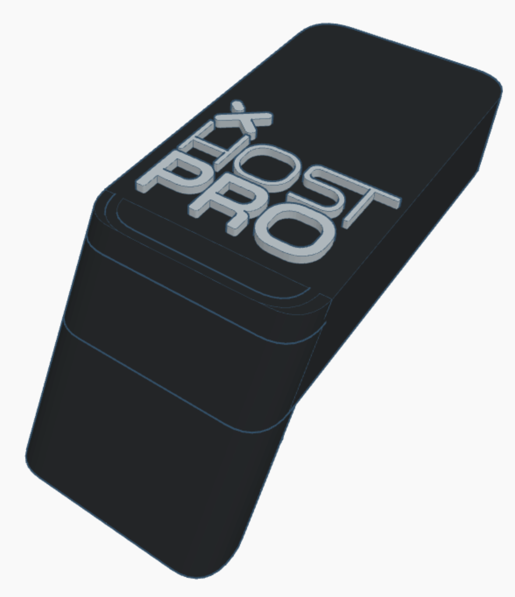

# xhost-pro-stl

STL files for the boxes that contains my xhost-pro project

Two versions provided ATM.

- ESP8266

  

  [Download STL files zip](https://github.com/xperiments/xhost-pro-stl/raw/main/stl/esp8266-xhost-pro-stl.zip)

- Lolin S2 Mini

  

  [Download STL files zip](https://github.com/xperiments/xhost-pro-stl/raw/main/stl/lolin-s2-mini-box-stl.zip)
